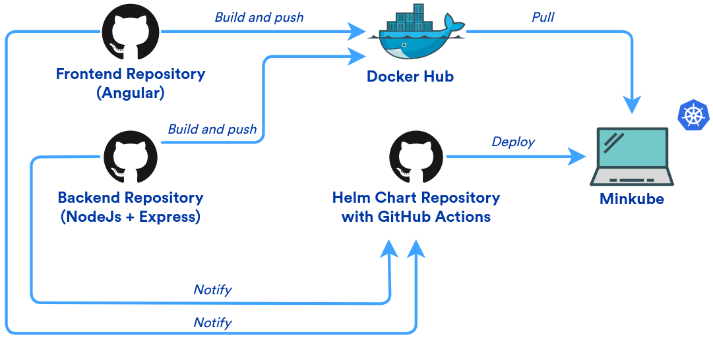

# Introduction
The aim of this project is to fully automate the process of compiling, creating Docker images as well as the deployment of the applications.
The project consists of three parts - a client application, a server application and a database. The client application is based on Angular and the server application is based on NodeJS and Express as a framework. In addition to these two apps, a PostgreSQL database is used.

## Used tools
The next section contains a list of the tools used in the project as well as a short explanation for each tool.

## GitHub Actions
The source code of both applications should result in a functional Docker image that can be further used and replicated. For this purpose, I use GitHub Actions. Using existing Actions makes it possible to quickly and easily create a Docker image and push it to Docker Hub.

## Minikube
For the purposes of this project I decided to work with a local Kubernetes cluster. Minikube allows us to set up a local cluster quite quickly and easily.

## Kubectl
Kubectl plays a key role in the management of a Kubernetes cluster, it allows overview of objects in the cluster as well as controlling their state.

## Helm
Helm is used to create a functioning whole out of all the applications. With the help of Helm I created a Chart for easy control of all the different parts of the project.

## Ngrok
Because I decided to work with a local Kubernetes cluster, I used Ngrok to securely access the Minikube webhooks from GitHub Actions.

## Architecture
In the picture below we can see the communication between different parts of the project. Each time new code pushed to the main branch of the frontend or backend repositories, a new Docker image is created which is then pushed to Docker Hub. The repositories then trigger the corresponding GitHub Action in a  third repository containing a Helm Chart that connects these two applications and a required database into complete and functioning project which is then pulled to the local Kubernetes cluster.

## Repositories

This project consists of three repositories:
- [Frontend application repository](https://github.com/taneskia/conduit_frontend_cicd)
- [Backend application repository](https://github.com/taneskia/conduit_backend_cicd)
- [Helm Chart repository (this one)](https://github.com/taneskia/conduit_cicd)

### Frontend repository
The Angular application is set up in this repository. It also contains the required workflow which is responsible for building a Docker image, pushing it to the appropriate [Docker Hub repository](https://hub.docker.com/r/andrejtaneski/conduit_frontend) and notifying the Helm Chart repo that a new version of the app is pushed to Docker Hub.

The GitHub Actions code as well as its explanation can be found [here](https://github.com/taneskia/conduit_frontend_cicd/blob/main/.github/workflows/pipeline.yml).

### Backend repository
The server application is set up in this repository. It also contains the required workflow is responsible for building a Docker image, pushing it to the appropriate [Docker Hub repository](https://hub.docker.com/r/andrejtaneski/conduit_backend) and notifying the Helm Chart repo that a new version of the app is pushed to Docker Hub.

The GitHub Actions code can be found [here](https://github.com/taneskia/conduit_backend_cicd/blob/main/.github/workflows/pipeline.yml).

### Helm Chart Repository
This repository contains a Helm Chart that connects the two applications and the required database into one whole. It also contains a workflow that can be called by the other two repositories to pull the new version of the application when any one of them is pushed to Docker Hub.

The GitHub Actions code as well as its explanation can be found [here](https://github.com/taneskia/conduit_cicd/blob/main/.github/workflows/pipeline.yml).

## Links
| Object  | Link |
| ------------- | ------------- |
| Frontend repository  | https://github.com/taneskia/conduit_frontend_cicd  |
| Backend repository  | https://github.com/taneskia/conduit_backend_cicd  |
| Helm chart repository  | https://github.com/taneskia/conduit_cicd  |
| Frontend docker image  | https://hub.docker.com/r/andrejtaneski/conduit_frontend  |
| Backend docker image  | https://hub.docker.com/r/andrejtaneski/conduit_backend  |